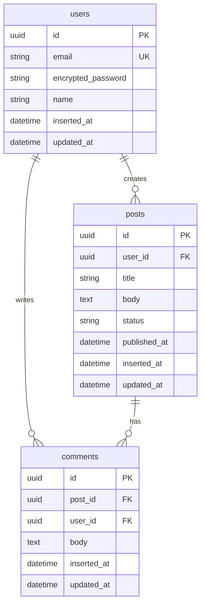

# データ設計

## 設計概要と対象データストア

### 採用データストア
- PostgreSQL (メインDB)
- Redis (キャッシュ・セッション管理) ※必要に応じて

### 設計方針
- 正規化レベル: 第3正規形を基本とし、パフォーマンス要件に応じて非正規化
- 主キー戦略: UUID v4 / 連番ID / 複合キー（選択理由を記載）
- タイムスタンプ: inserted_at, updated_at を全テーブルに付与

## 物理設計図



## スキーマ定義

### users テーブル
| カラム名 | 型 | 制約 | 説明 |
|---------|---|-----|-----|
| id | UUID | PK, NOT NULL | 主キー |
| email | VARCHAR(255) | UK, NOT NULL | メールアドレス |
| encrypted_password | VARCHAR(255) | NOT NULL | 暗号化済みパスワード |
| name | VARCHAR(100) | NOT NULL | 表示名 |
| inserted_at | TIMESTAMP | NOT NULL | 作成日時 |
| updated_at | TIMESTAMP | NOT NULL | 更新日時 |

#### インデックス
- `users_email_index` (email) - ログイン時の検索用

### posts テーブル
| カラム名 | 型 | 制約 | 説明 | 取りうる値 |
|---------|---|-----|-----|-----------|
| id | UUID | PK, NOT NULL | 主キー | |
| user_id | UUID | FK, NOT NULL | 投稿者ID | |
| title | VARCHAR(255) | NOT NULL | タイトル | |
| body | TEXT | | 本文 | |
| status | VARCHAR(20) | NOT NULL, DEFAULT 'draft' | ステータス | draft, published, archived |
| published_at | TIMESTAMP | | 公開日時 | |

### comments テーブル
（同様の形式で記載）

## 外部出力物

### PDF帳票
- 月次レポート
  - ファイル名: `monthly_report_YYYYMM.pdf`
  - サンプル: `/sample_outputs/monthly_report_sample.pdf`
  - 構造:
    ```
    {
      "title": "月次レポート",
      "period": "2024年1月",
      "summary": {...},
      "details": [...]
    }
    ```

## 実装上の考慮事項

### マイグレーション順序
1. users → posts → comments の順序で作成
2. 外部キー制約は全テーブル作成後に追加

### パフォーマンス考慮
- posts.user_id には必ずインデックスを付与（N+1対策）
- 大量データが予想される場合はパーティショニングを検討

### データ整合性
- 論理削除vs物理削除の方針
- カスケード削除の設定

## 設計根拠とトレードオフ

### UUID vs 連番ID
- 選択: UUID
- 理由: 分散システムでの一意性保証、URLでのID推測防止
- トレードオフ: ストレージサイズ増加、インデックス効率の低下

### status のEnum管理
- DB制約 vs アプリケーション層での管理
- 選択: アプリケーション層（Ecto.Enum）
- 理由: 値の追加が容易、国際化対応が可能