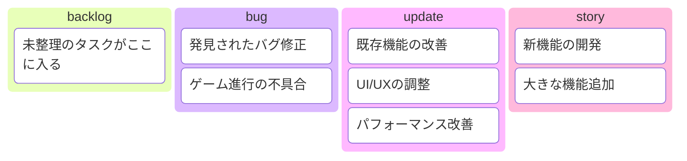
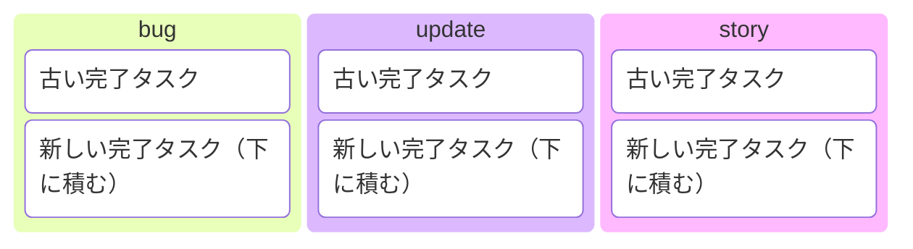

# プロジェクト進捗管理

## 管理方法

- **優先度**: 各カラム内で上から下へ優先順位
- **新規追加**: 適切なカラムの最下部に追加
- **移動**: 作業開始時や状況変化時に適切なカラムへ移動
- **issue_builder**: 必要に応じてkanban.mdからタスクを参照・選択
- **完了**: kanban_history_{yyyymm}.mdへ移動

## historyファイル形式

### ファイル名
`kanban_history_{yyyymm}.md` （例: kanban_history_202501.md）

### 内容構成

### issue_builder完了時の処理
- kanban.mdに該当タスクがある場合: kanban.mdから削除してkanban_history_{yyyymm}.mdに移動
- kanban.mdにない新規タスク: kanban_history_{yyyymm}.mdに新規作成
- いずれも適切なカラムの**最下部**に追加
- 月が変わったら新しいhistoryファイルを作成